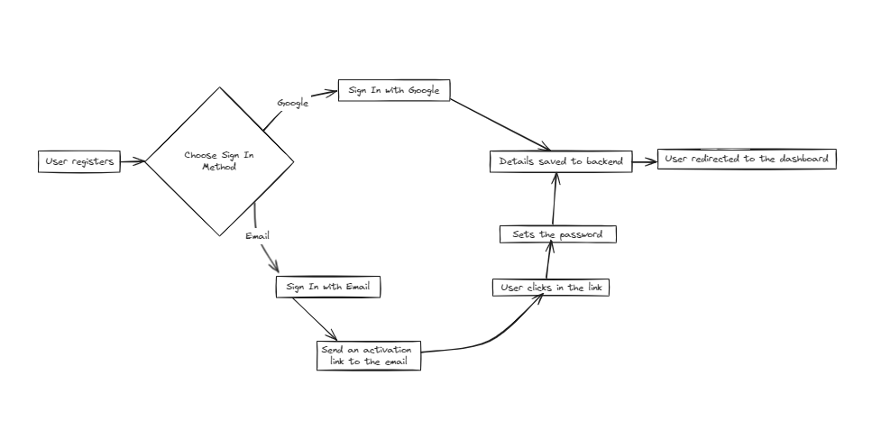
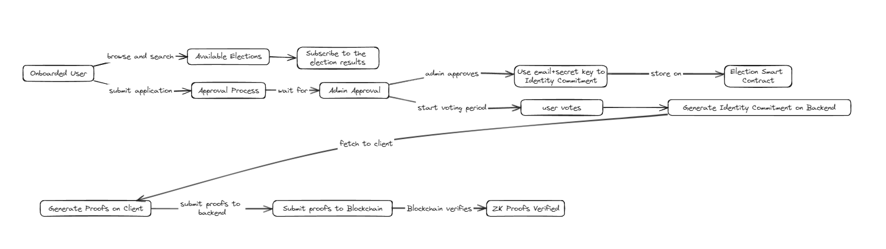
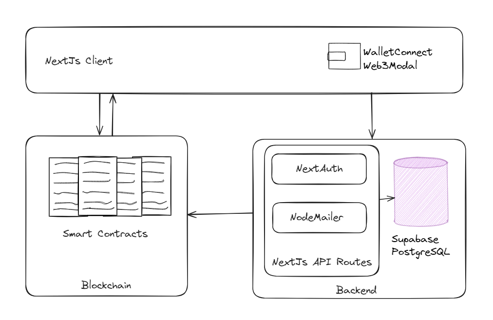
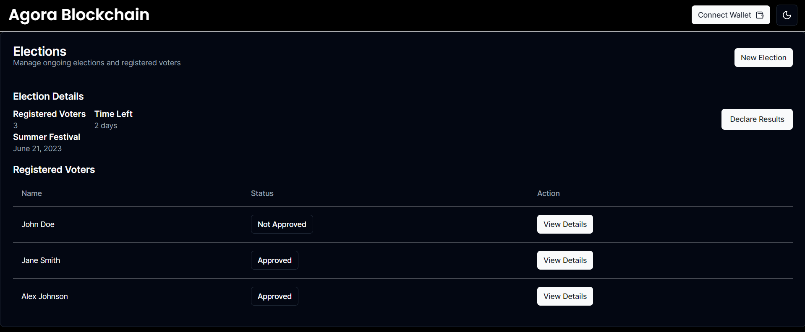
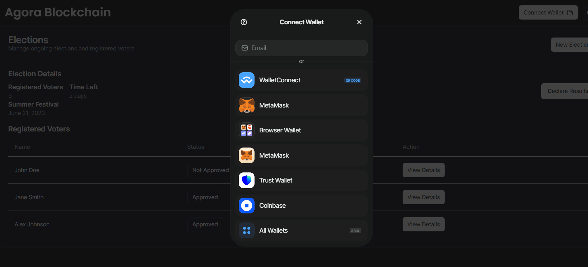
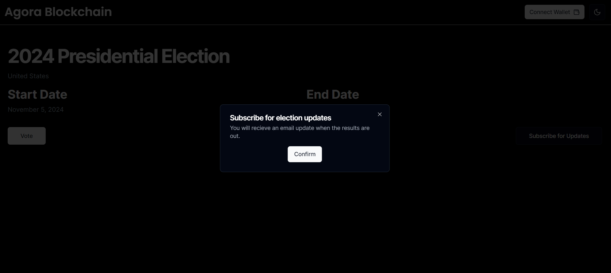

# Google Summer of Code 2024

## Project Proposal - Agora Blockchain

### Contact Information

Name: Aditya Bhattad

Email: adityabhattad18@gmail.com

Address: Gittikhadan Chowk, Katol Road, Nagpur 440013.


### Education

College Name: [Shri Ramdeobaba College of Engineering and Management](http://www.rknec.edu/)

Degree: Bachelor of Technology in Computer Science and Engineering

Expected Graduation Year: 2025

*The Cumulative Grade Point Average (CGPA) is a grading system used in Indian colleges and universities to evaluate a student's overall academic performance. It is calculated on a 10-point scale.*

CGPA: 8.9 (till 5th semester)


### Commitment

**How many hours will you work per week on your GSoC project?**
I anticipate being able to dedicate approximately 30 hours per week to this project during the GSoC period. 

**Do you have any commitments during the GSoC Period ?**
I have no other major commitments during this time and will be fully focused on the project.

# Chosen Project: Agora Blockchain

## Chosen Idea:

### 1.Introduction

**1.1 Project Overview**

The Agora Blockchain DApp is a decentralized voting application that enables secure, transparent and anonymous voting processes using zero knowledge proofs and blockchain. It offers features such as user registration, election creation, voting, result calculation, user KYC using Polygon ID, and an anonymous voting flow using the Semaphore library.

**1.2 Current State of Agora Blockchain DApp**

While the Agora Blockchain DApp provides a solid foundation for conducting elections on the blockchain, there are several areas that can be enhanced to improve user experience, accessibility, and overall functionality. The current implementation lacks sufficient abstraction of blockchain complexities for non-technical users, and the codebase requires refactoring and organization to facilitate easier development and maintenance.

**1.3 Proposed Enhancements**

This proposal aims to enhance the current Election DApp by adding new features and refactoring existing ones.
Here is a summary of the proposed improvements:

1. **Abstraction of Blockchain**: The goal is to partially abstract the blockchain part from the election administrator and fully abstract it from the voter. This will allow users to enjoy the benefits of blockchain technology, such as immutability, without having to worry about their wallet address or blockchain transactions. The user experience will be native and completely anonymous and secure.
2. **Election Subscription**: Allow voters to subscribe to election results and receive notifications when elections conclude, keeping them engaged and informed.
3. **Code Refactoring**: Rewrite the Client Side Code in `Nextjs`/ `Typescript` and Organize the Codebase: The current repository is divided into several different folders, such as client, server, `clientAnonymous`, and `serverAnonymous`. Some libraries used in the client, like `rimble-ui`and `libsemaphore`, are long deprecated and not actively maintained anymore. This leads to a poor developer experience and slows down development due to conflicts. Rewriting the client and organizing the codebase properly can solve these issues.
4. **Connect Anonymous Voting to Multiple Voting Algorithms and Extensively Test Smart Contracts**: Currently, anonymous voting only supports normal general election types. It needs to be integrated with other smart contracts in the codebase that have implemented multiple election algorithms. To gain the trust of users and avoid bugs during usage, an extensive test suite that tests every aspect of the smart contract is required. This will make the smart contract much more reliable.
5. **Add More Election Types**: There is still room to add more election types, such as approval voting and quadratic voting, to give users more choices.

By implementing these enhancements, the Election D-App will become more user-friendly, secure, and accessible to a wider audience. The proposed changes will significantly improve the user experience, increase trust in the platform, and contribute to the overall adoption of the project.

## **Vision and Project Impact**

Why I choose Agora Blockchain?
I have been actively writing code for around 2.5 years. Since the beginning, one of my main goals has been to contribute to the betterment of the internet and make this digital revolution more accessible. With this aim in mind, I discovered blockchain technology about 1.5 years ago. I learned how it can solve pressing internet challenges related to trust, centralization, and transparency. 

While exploring blockchain use cases, I realized that voting is one of the most relevant applications. In fact, the first major project I worked on was an election dapp: https://devpost.com/software/decentralized-voting-system-v83rphin in late 2022 as part of Chainlink fall hackathon.

Last year, while exploring opportunities to participate in Google Summer of Code, I discovered AOSSIE and Agora Blockchain. I was thrilled to find a project that aligned with my vision of leveraging blockchain for secure and transparent voting.

Although I was not selected for GSoC last year, I have been following the project closely. The introduction of anonymous signaling for zero-knowledge voting by last year's GSoC contributor Mr. Kumar Harsh made the project even more intriguing. It allows the community to benefit from transparency and immutability, while enabling users to cast votes anonymously, making it safer and more comfortable for them to vote honestly.

This year, my proposed ideas of implementing notifications, abstraction, and codebase improvements aim to advance the project further. The thought of this project one day being used by communities to securely conduct elections motivates me to contribute to this project. I believe Agora Blockchain is important because it aims to leverage blockchain to enable open, tamper-proof voting processes that protect voter privacy. I am excited by the opportunity to help drive this important innovation forward.

## Motivation

Over the past 2.5 years, I have developed a strong interest for blockchain and its potential to revolutionize various industries. This interest has driven me to gain extensive hands-on experience in developing blockchain applications through personal projects and participating in numerous web3 hackathons.

My deep familiarity with the Agora Blockchain codebase, gained through closely following the project for the past year, enables me to quickly understand the existing architecture and efficiently implement the proposed enhancements. This knowledge will allow me to hit the ground running and deliver high-quality results within the project timeline.

Moreover, my strong technical skills in relevant technologies such as Solidity, Next.js, and Ethereum,  equip me with the necessary expertise to tackle the challenges of implementing notifications, abstraction, and codebase improvements in Agora Blockchain.

Beyond technical proficiency, what truly sets me apart is my commitment to the project's vision and my drive to take it to new heights. I am deeply passionate about leveraging blockchain technology to revolutionize the voting process, ensuring transparency, security, and accessibility. This alignment with Agora Blockchain's mission fuels my motivation to deliver exceptional results and contribute to the project's long-term success.

Furthermore, my experience in collaborating with diverse teams through open-source projects and hackathons has honed my communication and problem-solving skills. I am confident in my ability to work effectively with the Agora Blockchain community, and mentor, to ensure smooth project execution and successful integration of the proposed features.

## Past Experience In Software Development

### Deduplication layer on Filecoin (ETHIndia 2022 Winner)
It solves problem of duplication IPFS, Using it if multiple users are storing the same file on IPFS, they all can share the cost of storing the file and there will be only copy (excluding fault-tolerance requirement) of that file exists in the network.

It uses: Solidity, NodeJs, Typescript, ReactJs, Hardhat, IPFS/Filecoin
https://devfolio.co/projects/deduplication-layer-on-filecoin-4bb1

### Decentralized Voting System (Chainlink Fall Hackathon 2022)

This application is a 100% transparent voting system, which is fully secured by blockchain's immutable nature and is impossible to tamper with.
It uses Chainlink keepers to automatically conclude the voting rounds after the preset amount of time is passed. It not only conducts a single voting round but also stores all the winner data of the previous round on the chain.

It uses: Ether.js, Hardhat, IPFS, NextJs, Solidity, Wagmi
https://devpost.com/software/decentralized-voting-system-v83rph


### personatokens.ai (Superhacks 2023)
Personatokens.ai is a marketplace where users can create
and trade AI characters as NFTs. These AI characters learn
and evolve through conversations – the more you interact
with them, the smarter and more engaging they become.

It uses: Solitity, Langchain, NextJs, Hardhat, Langchain, Redis, uUpstash
https://ethglobal.com/showcase/personatokens-ai-szkan

### SuperWallet (ETHOnline hackathon 2023 Winner)
SuperWallet is a secure, unified multi-chain transaction
system, allowing users to initiate payments using
coins/tokens across multiple chains simultaneously with
ease

It uses: Solidity, NextJs, Biconony SDK, Particle Auth, Axelar General Message Passing Gateway
passing
https://ethglobal.com/showcase/superwallet-wvqtj

### PeerPlay (HackFS 2023 Winner)
Blockchain based NFT gated video sharing platform.

It uses: Solidity, Hardhat, ENS, NextJs, Push Protocol, Web Sockets
https://ethglobal.com/showcase/peerplay-jqwpa

### Contributions to Agora Blockchain

- Pull Request #54: [**Fix navigation on signup/register, fix styling on dashboard and add hardhat-deploy**](https://gitlab.com/aossie/agora-blockchain/-/merge_requests/54) : The first two commits fixes issue [#36](https://www.notion.so/aossie/agora-blockchain/-/issues/36)
 by redirecting the user to the dashboard automatically after successful registration on the Auth page. I used the useNavigate hook from react-router-dom to implement this feature. Further I have added the hardhat-deploy functionality to the server. With this update, contracts can now be deployed using a simple command: `npx hardhat deploy --network localhost`
. This replaces the previous command: `npx hardhat run --network localhost scripts/deploy.js`
. The deployment scripts are now maintained in a separate folder called deploy, making it easier to navigate. Additionally, the addresses of deployed contracts are automatically updated in the frontend folder with every new deployment. This eliminates the need for manual updates.
- Pull Request #88: [**Improving Frontend Codebase by Eliminating Hardcoded Values**](https://gitlab.com/aossie/agora-blockchain/-/merge_requests/88) :  
Here I Removed all the hardcoded values and improved UI of the DApp.
- Pull Request #110: [**Implemented the Oklahoma Voting System on frontend.**](https://gitlab.com/aossie/agora-blockchain/-/merge_requests/110)
- Pull Request #111: [**Optimized smart contracts**](https://gitlab.com/aossie/agora-blockchain/-/merge_requests/111) : Earlier, the smart contract deployment structure was flawed as it was deploying multiple Result Calculator and Election Ballots, even when the code could be easily reused. This approach caused the smart contract size to increase beyond the expected limit and exceed the smart contract max size limit introduced in EIP-170.
To resolve this issue, I made the following changes:
  - Instead of deploying all the contracts together, I deployed each contract separately.
  - I passed the address of each contract to the constructor, instead of deploying them from the constructor.
  - For each election, I did not deployed different ballots and result calculators but reused already deployed ballot and result calculator.
  - Whenever a ballot or result calculator is needed, I return the address, typecasted into the respective ballot or result calculator type.
- Pull Request #111: [**Implemented the Range Voting System on frontend.**](https://gitlab.com/aossie/agora-blockchain/-/merge_requests/112)
- Pull Request #11: [**Fix Webpack Configuration for Missing Polyfills with React-Rewired.**](https://github.com/AOSSIE-Org/Agora-Blockchain/pull/11)
- Pull Request #12: [**Fix register.js by correctly using ethersjs to connect to metamask.**](https://github.com/AOSSIE-Org/Agora-Blockchain/pull/12)
- Pull Request #27 [**Fix OneVote and VotingProcess.sol Issues and Implement ZK Voting Client Enhancements.**](https://github.com/AOSSIE-Org/Agora-Blockchain/pull/28)
- Pull Request # 29 [**Integrate Web3Modal for Wallet Connection Handling on ZK Voting Part of Frontend.**](https://github.com/AOSSIE-Org/Agora-Blockchain/pull/30)


## Detailed Proposal Description

## 1. Abstraction of Blockchain

## **1.1 Motivation and Goals**

In 2024, abstraction plays a crucial role in the adoption of blockchain-powered applications. Users should be able to benefit from immutability and security without needing to understand the underlying blockchain technology. 

The goals of this part of the project are:

1. Allow general users to register and vote without interacting with blockchain wallets
2. Partially abstract blockchain details for election admins while still giving them control
3. Provide a seamless, web2-like user experience while leveraging web3 benefits under the hood

## 1.2 User Flows
### 1.2.1 Onboarding Flow for General Users
1. User registers to the application using a standard web2 flow like sign in with Google or email. User details are saved to the backend.
2. Backend generates a random passphrase string and maps it to the user account. This will later be used to create the identity commitment for the user.
3. User is acknowledged and redirected to the general dashboard of the voting application.
      

      
### 1.2.2 Election Admin Flow
1. Registered users can choose to create an election. When they click on create election button, they are prompted to connect their web3 wallet in order make a smart contract call to create election on blockchain, which is necessary for the election admin to have independent control, making our application truly decentralized.
To make our application more accessible we can enable functionality that will allow the user to create wallet on fly using their connected email addresses.
1. Once the wallet is connected and linked to their account, the election admin will:
   1. Choose the election type
   2. Add the election title and description
   3. Add candidates
   4. Set the start time and duration for the election
   5. And click submit
2. Election details are sent to the entry point smart contract, from where a new proxy contract is deployed which will be linked to the logic contracts (Ballot and Result Calculators) of the selected algorithm.
3. Upon successful blockchain transaction, backend is updated with election details metadata and admin is redirected to admin dashboard from where they can manage the election and approve voters.


  
### 1.2.3 Voter Flow
1. On boarded users can browse and search available elections.
2. To vote in the particular election, users first have to submit application for approval from the admin on their election page.
3. Users wait for approval from the election admin.
4. When an admin approves the user, their email address along with a secret key on the backend, is used to generate an Identity Commitment, which will be stored on the smart contract of the election they have been approved for.
5. Voters are notified via email once approved.
6. After approval, when the voting period starts, the user can submit their vote:
   1. When user clicks on vote, their Identity Commitment is again generated on the backend using their email and secret key, which then fetched to the client to generate ZK proofs.
   2. Using the users identity commitment and the election Id the ZK proofs are generated on the client.
   3. Proofs are submitted to backend which works as a middle layer in this case, from here the proofs are submitted to the blockchain in a transaction.
   4. Blockchain verifies the ZK proofs to confirm the user is an approved voter who hasn't yet voted. If valid, their vote is registered.
7. Users can subscribe to an election to be notified of the results via email once it concludes.
  

  

## 1.3 Technical Implementation

Assuming we are rewriting the client in Next.js, here is an overview of the technical implementation:

- Use Next.js to create user interfaces for registration, election creation/management, and voting.
- Integrate Web3Modal library for seamless web3 wallet connection and on-the-fly wallet creation for election admins.
- Use Next.js API routes to handle backend logic like user registration, identity commitment generation and working as a middle layer to send the ZK Proofs to the blockchain.
- Utilize Semaphore SDK to develop anonymous voting flow
- Use Supabase PostgreSQL to store user info and election metadata.
- Utilize NextAuth to handle user authentication in the application.

### 1.3.1 Architecture
  

  
### 1.3.2 Frontend Implementation in Next.js/TypeScript
#### 1.3.2.1 Screens
      
Frontend will have the following screens: 
      
- **Agora Blockchain Landing Page (Not protected)**: This page can be used to explain how the entire anonymous flow works, and a brief overview about all the available algorithms, this will help the election organizer to make an informed choice while election algorithm selection.
- **Login/Registration Page (Not protected)**: We can conditionally render login and register input fields and an separate option to sign in with google.
- **General Dashboard (Not protected)**: This page will contains stats about all the election like created, on going, concluded, etc. and list of all the elections in table along with a search bar to search for the relevant election.
- **Election Creation Modal (Protected)**: The modal will contain input field for election title, election description, election type, and start date and duration of the election.
- **Election Admin dashboard (Protected)**: This will contain list of all the elections created by the users, list of all the voters applied for the election, a button to add candidates for the election, and a button to conclude the election.
      
    
          
- **Add candidate Modal (Protected)**: This will contain input fields for name, description and image of the candidate.
- **Election Page (Protected)**: This page will contain the election details like start time, end time, number of voters registered for the election, candidates contesting in the elections, etc.
- **Vote Modal (Protected)**: This will contain input field to choose candidate from the all the candidates to vote in the elections, we will have to conditionally render multiple types of UIs here based on the election algorithm.
  
#### 1.3.2.2 User Authentication with NextAuth.js (Backend side of the logic is discussed separately).


1. After setting up the NextAuth.Js on backend we will have to implement a middleware that will block the access to the protected pages of our application.
          
This can be implemented by adding `middleware.ts` file in the root of our NextJs Application.
          
 ```tsx
 import NextAuth from "next-auth";
 import authConfig from "./auth.config";  // this will be covered in the backend part.
 import { DEFAULT_LOGIN_REDIRECT, publicRoutes } from "./routes";
 
 const { auth } = NextAuth(authConfig);
 
 const apiAuthPrefix = "/api/auth";
 
 const publicRoutes = [
     "/",
     "/auth/verify-email",
 ];
 
 const authRoutes = [
     "/auth/login",
     "/auth/register",
     "/auth/error",
 ];
 
 const DEFAULT_LOGIN_REDIRECT = "/dashboard";
 
 export default auth((req) => {
     const { nextUrl } = req;
     const isLoggedIn = !!req.auth;
 
     const isApiAuthRoute = nextUrl.pathname.startsWith(apiAuthPrefix);
     const isPublicRoute = publicRoutes.includes(nextUrl.pathname);
     const isAuthRoute = authRoutes.includes(nextUrl.pathname);
 
     if (isApiAuthRoute) {
         return null;
     }
 
     if (isAuthRoute) {
         if (isLoggedIn) {
             return Response.redirect(new URL(DEFAULT_LOGIN_REDIRECT, nextUrl));
         }
         return null;
     }
 
     if (!isLoggedIn && !isPublicRoute) {
         let callBackUrl = nextUrl.pathname;
         if (nextUrl.search) {
             callBackUrl += nextUrl.search;
         }
 
         const encodedCallbackUrl = encodeURIComponent(callBackUrl);
         return Response.redirect(new URL(`/auth/login?callbackUrl=${encodedCallbackUrl}`, nextUrl));
     }
 
     return null;
 })
 
 export const config = {
     matcher: ["/((?!api|_next/static|_next/image|favicon.ico).*)"],
 }
 ```
          
1. To be able to use/display users information throughout the client, we will need to use the `useSession` hook, for that first we have to expose the session context, **`<SessionProvider />`**, at the top level of our application:
 
 ```tsx
 export default async function RootLayout({
   children,
 }: Readonly<{
   children: React.ReactNode;
 }>) {
   const session = await auth();
   return (
     <SessionProvider session={session}>
       <html lang="en">
         <body className={inter.className}>{children}</body>
       </html>
     </SessionProvider>
   );
 }
 ```
          
2. Then we can use the user information in any component like this:
          
```tsx
import { useSession } from "next-auth/react"
export default function Component() {
const { data: session } = useSession()
  return (
       <>
         Signed in as {session.user.email}
       </>
    }
}
 ```
          
  
#### 1.3.2.3: Add functionality to connect wallet for the election organizer
To streamline the development of the connect wallet flow and make wallet connection experience smoother by adding functionality to generate a wallet on fly using email address, we can use walletconnect’s `web3modal` .
      
To set it up we have to:

1. Create a new file `context/web3modal.tsx` outside the app directory, this file will include all the configuration required for web3 modal.
          
```tsx
'use client'

import { createWeb3Modal, defaultConfig } from '@web3modal/ethers5/react'

const projectId = process.env.WALLET_CONNECT_PROJECT_ID

// example chain
const mainnet = {
chainId: 1,
name: 'Ethereum',
currency: 'ETH',
explorerUrl: 'https://etherscan.io',
rpcUrl: 'https://cloudflare-eth.com'
}

// 3. Create a metadata object
const metadata = {
name: 'Agora Blockchain',
description: 'Agora is a blockchain-based voting system that allows for secure, anonymous, and transparent voting',
url: 'https://agorablockchain.com', // origin must match your domain & subdomain
icons: ['https://icon.agorablockchain.com/']
}

// 4. Create Ethers config
const ethersConfig = defaultConfig({
metadata,
enableEmail: true // This well enable option to create wallet with email addresses
})

// 5. Create a Web3Modal instance
createWeb3Modal({
ethersConfig,
chains: [mainnet],
projectId,
})

export function Web3Modal({ children }) {
return children
}
```
    
2. To make `useWeb3Modal` hook available in our entire application we will have to  expose this **`<Web3Modal />`** context, at the top level of our application:
    
 ```tsx
 import './globals.css'
 
 import { Web3Modal } from '../context/web3modal'
 
 export const metadata = {
   title: 'Web3Modal',
   description: 'Web3Modal Example'
 }
 
 export default function RootLayout({ children }) {
   return (
   <SessionProvider session={session}>
       <html lang="en">
         <body className={inter.className}>
 		       <Web3Modal>{children}</Web3Modal>
         </body>
       </html>
     </SessionProvider>
   )
 }
 ```
          
3. Then we can simple use `useWeb3Modal` hook to trigger the wallet connection modal
          
 ```tsx
 import { useWeb3Modal } from '@web3modal/ethers/react'
 
 export default function ConnectButton() {
   // 4. Use modal hook
   const { open } = useWeb3Modal()
 
   return (
     <>
       <button onClick={() => open()}>ConnectWallet</button>
     </>
   )
 }
 ```
  
On clicking `Connect Wallet`, a modal like this will show up, allowing the user to connect their browser wallet or create a wallet with their emails.
 

          
#### 1.3.2.4: Using semaphore SDK to generate zero knowledge proofs on the frontend
      
What is Semaphore?

[Semaphore](https://github.com/semaphore-protocol/semaphore/tree/v3.15.2) is a [zero-knowledge](https://z.cash/technology/zksnarks) protocol that allows users to cast a signal (In user case a vote) as a provable group member (i.e. voter approved by the election admin) without revealing users identity. Additionally, it provides a simple mechanism to prevent double-signaling (casting vote more than ones). 

It consists of three main parts

- Semaphore groups: A Semaphore group is an [incremental Merkle tree](https://docs.semaphore.pse.dev/V3/glossary#incremental-merkle-tree), and group members are tree leaves. Semaphore groups set the following three parameters:
    - **Group id**: a unique identifier for the group
    - **Tree depth**: the maximum number of members a group can contain (`max size = 2 ^ tree depth`)
    - **Members**: the list of members to initialize the group.

- Semaphore identities: In order to join a semaphore group, a user must first create a semaphore identity.   
Identity contains two random secret values: `trapdoor` and `nullifier`, and one public value: `commitment`.
    
  <aside>
  💡 Poseidon is a specialized hash function co-designed with zk-proof systems in mind, enabling practical hashing of field elements inside zk-friendly arithmetic circuits with attractive performance and security properties.
  
  </aside>
    
  The Poseidon hash of the identity nullifier and trapdoor is called the *identity secret*, and its hash is the *identity commitment*.
  
  An identity commitment, similarly to Ethereum addresses, is a public value used in Semaphore groups to represent the identity of a group member. The secret values are similar to Ethereum private keys and are used to generate Semaphore zero-knowledge proofs and authenticate signals.
    
- Semaphore proofs: Once a user joins their Semaphore identity to a Semaphore group, the user can signal anonymously with a zero-knowledge proof that proves the following:
    - the user is a member of the group,
    - the same user created the signal and the proof.

We can use these three in combination to implement our anonymous voting flow:

1. When the voter applies for the an election, and is approved by the admin an deterministic identity is created for the user using combination of their verified `email` and a `secret-key` stored on the backend. 
2. The identity commitment (i.e. Public Value) is added to the on-chain group that corresponding to an particular election.
3. Then, when a approved user clicks on cast vote on the client:


  - The group corresponding to the election is fetched from the blockchain.
              
```tsx
import { Group } from "@semaphore-protocol/group"
import { SemaphoreEthers } from "@semaphore-protocol/data"

function getGroupId(electionId:number):Group{
		const groupId = electionId
		const semaphoreEthers = new SemaphoreEthers(process.env.NEXT_PUBLIC_RPC_URL)
		const members = await semaphoreEthers.getGroupMembers(groupId)
		const group = new Group(groupId, members);
		return group;
}
```
      
  - The identity is re-generated on the using the server actions and identity commitment is retrieved on the client.
              
```tsx
// Generate identity commitment using secret key and email
"use server"
import crypto from 'crypto';
import { Identity } from "@semaphore-protocol/identity"

export function getUserIdentityCommitment(userEmail: string): string {
  const hash = crypto.createHash('sha256');
  
  const length:number = 32;
  const seed = userEmail + process.env.SECRET_KEY;
  hash.update(seed);
  const buffer = crypto.randomBytes(length);
  const charCodes = new Array(length);
  for (let i = 0; i < length; i++) {
    const hashByte = hash.digest()[0];
    const combinedByte = hashByte ^ buffer[i];
    const charCode = 32 + (combinedByte % 95);
    charCodes[i] = charCode;
    hash.update(String.fromCharCode(charCode));
  }
  const hashStr = String.fromCharCode(...charCodes);
  const identity = new Identity(hasStr)
	return {"identityCommitment":identity.commitment};
}
```
              
```tsx
// Get the identity commitment on the client
let identityCommitment;
getUserIdentityCommitment(session.user.email).then((data) => {
       identityCommitment = data.identityCommitment;
 }).catch((error) => {
       setError("Something went wrong!");
       console.log('[VOTE_MODAL]: ', error);
});
```
              
- ZK Proofs are generated which can prove that user is approved by the election admin and is the same user who created the proof.
              
```tsx
import { generateProof } from "@semaphore-protocol/proof";

const { proof, merkleTreeRoot, nullifierHash } = await generateProof(
         identity,
         group,
         electionId.toNumber(),
         vote
 );
```
              
- The ZK Proofs along with the user vote, are then passed to the backend, from where they are then submitted to the blockchain, to be verified and then their vote is registered.
              
<aside>
💡 External nullifier is used to prevent user from voting twice in the same election.

</aside>

  ```tsx
  let response;
  response = await fetch("api/vote", {
          method: "POST",
          headers: { "Content-Type": "application/json" },
          body: JSON.stringify({
                vote,
                merkleTreeRoot,
                nullifierHash,
                proof,
                // This will work as external nullifier.
                electionId
  	      })
   })
  ```
  
### 1.3.3 Backend Implementation
#### 1.3.3.1: Setup database with Prisma as ORM.
- Database design: The database schema consists of four main tables: Users, Elections, Candidates, and Voter_Registrations.
  - The Users table stores information about all of our application's users, it includes their unique user_id, email, user_type (normal or election_creator), and wallet_address. The user_type field differentiates between regular users who can register to vote and users who can create elections. The wallet_address is used to connect the user's web3 wallet for creating elections.
  - The Elections table contains details about each election, such as its unique election_id, creator_id (referencing the Users table), contract_address of the associated smart contract, title, description,type, start_time, end_time, status, subscribed users and the election result.
  - The Candidates table stores information about the candidates for each election. It includes a unique candidate_id, the election_id it belongs to (referencing the Elections table), the candidate's name, additional information, a photo_url.
  - The Voter_Registrations table manages the voter registration process. It contains a unique registration_id, the election_id (referencing the Elections table), the user_id of the voter (referencing the Users table), and the status of their registration (pending, approved, or rejected.

- Setting up Prisma as ORM:

1. `prisma/schema.prisma` file:
          
```tsx
datasource db {
  provider = "postgresql"
  url      = env("DATABASE_URL")
}

generator client {
  provider = "prisma-client-js"
}

model User {
  user_id        String            @id @default(cuid())
  email          String            @unique
  user_type      String
  wallet_address String?
  registrations  Voter_Registration[]
}

model Election {
  election_id      String        @id @default(cuid())
  creator_id       String
  contract_address String
  title            String
  description      String
  electionType     String
  start_time       DateTime
  end_time         DateTime
  status           String
  result           String?  // we will store candidate_id here.
  candidates       Candidate[]
  registrations    Voter_Registration[]
  subscribed_users User[]
  candidate  Candidate @relation(fields: [result],references: [candidate_id]
}

model Candidate {
  candidate_id String       @id @default(cuid())
  election_id  String
  name         String
  info         String?
  photo_url    String?
  election     Elections @relation(fields: [election_id], references: [election_id])
}

model Voter_Registration {
  registration_id String       @id @default(cuid())
  election_id     String
  user_id         String
  status          String
  election        Elections @relation(fields: [election_id], references: [election_id])
  user            Users     @relation(fields: [user_id], references: [user_id])
}

// ############ Tables below are required for next auth ###############
model Account {
  id                String  @id @default(cuid())
  userId            String
  type              String
  provider          String
  providerAccountId String
  refresh_token     String? @db.Text
  access_token      String? @db.Text
  expires_at        Int?
  token_type        String?
  scope             String?
  id_token          String? @db.Text
  session_state     String?

  user User @relation(fields: [userId], references: [user_id], onDelete: Cascade)
}

model VerificationToken {
  id      String   @id @default(cuid())
  email   String
  token   String   @unique
  expires DateTime

  @@unique([email, token])
}
```
          
2. To set up Prisma client we need to create new file `lib/prisma.ts` as follows:
          
```tsx
import { PrismaClient } from '@prisma/client';

const globalForPrisma = global as unknown as { prisma: PrismaClient };

export const prisma =
  globalForPrisma.prisma ||
  new PrismaClient({
    log: ['query'],
  });

if (process.env.NODE_ENV !== 'production') globalForPrisma.prisma = prisma;
```
          
This will allow us to easily query the database from our API routes and server components when needed.
          
#### 1.3.3.2: Setup NextAuth.Js

As we provide our users with two options to login/register: 
1. Sign In with Google
2. Email and Password

We will have to create two files in the root of our project:

1. auth.config.ts

```tsx
// We have this file so that we can use edge, even though prisma doesn't works with edge.
import Credentials from "next-auth/providers/credentials";
import Google from "next-auth/providers/google";

import type { NextAuthConfig } from "next-auth";
import { LoginSchema } from "./form-schema";
import { getUserByEmail } from "./utils/user";
import bcrypt from "bcryptjs";

export default {
   providers: [
       Google({
           clientId: process.env.GOOGLE_CLIENT_ID,
           clientSecret: process.env.GOOGLE_CLIENT_SECRET,
       }),
       Credentials({
           async authorize(credentials) {

               const validatedFields = LoginSchema.safeParse(credentials);

               if (validatedFields.success) {
                   const { email, password } = validatedFields.data;

                   const user = await getUserByEmail(email);
                   if (!user || !user.password) {
                       return null;
                   }

                   const isPasswordCorrect = await bcrypt.compare(
                       password,
                       user.password
                   );

                   if (isPasswordCorrect) {
                       return user;
                   }
               }
               return null;
           }
       })
   ],
} satisfies NextAuthConfig;
```
              
2. auth.ts
              
```tsx
import NextAuth, { type DefaultSession, type User } from "next-auth";
import { PrismaAdapter } from "@auth/prisma-adapter";
import { db } from "./lib/db";
import authConfig from "./auth.config";
import { getUserById } from "./utils/user";
import { getTwoFactorConfirmationByUserId } from "./utils/two-factor-confirmation";
import { getAccountByUserId } from "./actions/account";

export type ExtendedUser = DefaultSession["user"] & {
   role: string;
   isOAuth: boolean;
}

declare module "next-auth" {
   interface Session {
       user: ExtendedUser;
   }
}

export const {
   handlers: { GET, POST },
   auth,
   signIn,
   signOut
} = NextAuth({
   // So that it automatically marks email verified on OAuth
   pages: {
       signIn: "/auth/login",
       error: "/auth/error"
   },
   events: {
       async linkAccount({ user }) {
           await db.user.update({
               where: {
                   id: user.id,
               },
               data: {
                   emailVerified: new Date(),
               }
           })
       }
   },
   callbacks: {
       async signIn({ user, account }) {

           if (account?.provider !== "credentials") {
               return true;
           }

           if (!user.id) {
               return false;
           }
           const existingUser = await getUserById(user.id);

           if (!existingUser || !existingUser.emailVerified) {
               return false;
           }

           return true;
       },
       async session({ token, session }) {
           if (token?.sub && session?.user) {
               session.user.id = token.sub;
           }
           if (token?.role && session?.user) {
               session.user.role = token.role;
           }
           if (session?.user) {
               session.user.email = token.email;
               session.user.isOAuth = token.isOAuth;
           }
           return session;
       },
       async jwt({ token }) {
           if (!token.sub) {
               return token;
           }
           const existingUser = await getUserById(token.sub);
           if (!existingUser) {
               return token;
           }
           const existingAccount = await getAccountByUserId(existingUser.id);
           token.isOAuth = !!existingAccount;
           token.email = existingUser.email;
           return token;
       }
   },
   adapter: PrismaAdapter(db),
   session: { strategy: "jwt" },
   ...authConfig
});
```
              
- Then in `app/api` directory of the client folder add a route group `auth/[...nextauth]/route.ts`
          
```tsx
export { GET, POST } from "@/auth";
```
          
This route will catch all authentication related requests.
          
*After this we will create server actions for `login` , `register` and `verify-email` that will be used from the corresponding pages on the client.*


#### 1.3.3.3: Handle user related routes
- Route to send proofs to the blockchain: `api/vote`
          
```tsx
import { NextResponse } from "next/server";

const PRIVATE_KEY = process.env.PRIVATE_KEY;
const ALCHEMY_API_KEY = process.env.ALCHEMY_API_KEY;
const contractAddress = process.env.ONEVOTE_ADDRESS;

export async function POST(req:Request){
    try{
		 const { vote, merkleTreeRoot, nullifierHash, proof,electionId} = req.json();  
	    
     const provider = new providers.AlchemyProvider(ALCHEMY_API_KEY);
	   const signer = new Wallet(PRIVATE_KEY,provider);
	   const contract = new Contract(contractAddress,oneVote.abi,signer);
		  
     const transaction = await contract.vote(vote,nullifierHash,electionId,merkleTreeRoot,proof);
	   await transaction.wait();
	   return new NextResponse("Success",{status:200})
	     
    }catch(error){
        console.log('[ERROR_WHILE_SUBMITTING_VOTE_TO_BLOCKCHAIN]: ',error);
        return new NextResponse("Server Error",{status:500})
    }
}
```
          
- Similarly we can create the following routes:
  - Route to add connect a wallet to user account `api/user/add-wallet`
  - Route to add election: `api/election/new`
  - Route to add candidate to the election: `api/election/[electionId]/add-candidate`
  - Route to register as a voter to the election: `api/election/[electionId]/register`
  - Route to subscribe  to get results of the election when declared  `api/elections/[electionId]/notify`
  - Route to approve a voter for election: `api/elections/[electionId]/approve`
 
### 1.3.4 Smart Contract Interactions
  
On the smart contract we will need to:
  
<aside>
💡 For sake of **explanation** we are considering OneVote.sol as an entry point contract and  VotingProcess.sol as the election contract, after integration with all the other election contracts which are implemented with diamond proxy, the functions we are modify will change.

</aside>
  
<aside>
💡 We are using contracts provided with semaphore SDK: these are set of opensource utility smart contracts, which are well audited making them appropriately **reliable**.

</aside>
  

1. Add a state variable to hold the address of our semaphore smart contract.
      
```tsx
ISemaphore public immutable semaphore;
```
      
2. Modify the constructor to save Semaphore contract address on deployment.
      
```tsx
constructor(ISemaphore _semaphore) {
        semaphore = ISemaphore(_semaphore);          
  }
```
      
3. Create election: while creating the election proxy contract, we will create new semaphore group on-chain.
      
```tsx
 function createVotingProcess(
        string memory _name,
        string memory _description,
        uint _startDate,
        uint _endDate,
        uint256 _groupId
    ) public {
        address _votingProcessAdmin = msg.sender;
        processCounter += 1;
        VotingProcess vp = new VotingProcess(
            processCounter,
            _name,
            _description,
            _startDate,
            _endDate
        );
        votingProcesses[processCounter] = vp;
        votingProcessAdmins[vp] = _votingProcessAdmin;
        semaphore.createGroup(_groupId, 32, address(msg.sender));
    }
```
      
4. Add voter to election: we have to add the identity commitment of all the voters approved by the election admin.
      
```tsx
function addVoter(uint256 identityCommitment) public {
        semaphore.addMember(groupId, identityCommitment);
        userAuthStatus[identityCommitment] = true;
}
```
      
5. Vote: This will have to be changed in order to first validate the ZK Proofs and only register the vote if the proof in valid.
      
```tsx
function vote(
        uint256 _vote, // candidate id.
        uint256 nullifierHash,
        uint256 pollId,
        uint256 merkleTreeRoot,
        uint256[8] calldata proof
    ) public {
        semaphore.verifyProof(
            groupId,
            merkleTreeRoot,
            _vote,
            nullifierHash,
            pollId,
            proof
        );
        votingProcesses[pollId].vote(_vote);
    }

```
      
## 1.4 Thought Process and Design Decisions:
#### Why do we need a backend when all the data can be directly stored and fetched from the blockchain?
  
  We need a backend because we cannot rely on the blockchain to fetch all the information needed to render our UI efficiently. By maintaining a database to store necessary information, we can efficiently implement logic to protect routes on the frontend and handle user authentication using email addresses. This way, we do not need to fetch the user authentication status for every single user.
  
  Maintaining a separate backend also allows us to abstract the blockchain wherever necessary, resulting in a more native experience for a large portion of internet users who are not familiar with web3.
  
#### Why not directly submit proofs from the client to the blockchain?
  1. Blockchain abstraction: If we send the proofs directly to the blockchain, it will require users to have a wallet and interact with the blockchain. This user experience will alienate many potential users who are not familiar with blockchain technology.
  2. User anonymity is compromised: Even if we choose to make connecting a wallet necessary for voters and have them make the vote call from the client, the transaction can still be linked to their wallet address, which is exactly what we are trying to avoid with our anonymous voting flow. Using the backend as a middle layer to send proofs, we use a common private key to send proofs for all users. This way, the transaction will only be linked to the common wallet and not the user, resulting in true user anonymity.
   
#### Why did I choose to exclude user KYC and have the election admin approve users manually?
  1. The scope of our application should initially be small organizations, communities, etc. Here, the verification requirements can vary greatly for different types of users, and this cannot be anyways covered by basic KYC all the time.
  2. If we consider implementing KYC we should keep it separate from our Agora Blockchain application to avoid doing multiple things in one repository and to keep reusability in mind.
  3. For automation of voter approval, we can later provide a single API to election admins, using which they could add checks and have all applications processed automatically using defined rules. Developing this is a significant task, so I put it out of scope to focus on implementing a good base first, but we can surely add it to the TODO list for our project.
#### How are transaction costs for making a vote call compensated?
  
I have given it some thought, and I believe the cost of conducting an election should be borne by the election organizer. We can make them pay while making the createElection call itself by adding one extra require statement inside the createElection function.
  
```solidity
require(msg.value>=/*The cost for conducting the election*/,"Please send ETH to cover the cost of conducting the election);
```
  
  However, I did not specifically mention it because, during development, we are using test tokens anyway. We can later discuss the cost with the mentor and organization admin and add that functionality accordingly.


# 2. Election Subscription and Voter Notifications

## 2.1 **Motivation and Goals**

Keeping users informed throughout the election process is important factor for good user experience. By introducing an election subscription and notification system, voters can stay updated on the status of elections they are interested in, receiving timely notifications when results are available. This feature aims to improve the overall user experience and increase participation by keeping them informed without the need for constant manual checking.

The primary goals of this feature are:

- Allow voters to subscribe to elections of their choice.
- Notify subscribed voters when election results are calculated and available.
## 2.2  **Flow**
1. **Election Creation**: When an election is created, the election details including the end date/time are stored in the database.
2. **Subscription**: Voters can subscribe to elections they are interested in through the UI.
3. **Cron Job**: A single cron job is set up to run at a frequent interval, such as every minute. This cron job does the following:
  1. Queries the database to check for any elections that have ended but have not had their results calculated yet.
  2. For each ended election found:
      - Calls the **`calculateResult`** function on the smart contract to calculate the results.
      - Updates the election status and results in the database.
      - Retrieves the list of subscribed voters for that election from the database.
      - Sends email notifications to the subscribed voters using nodemailer, informing them that the election has ended and the results are available.
4. **View Results**:  Users can view the election results by clicking on a link in the email notification, which takes them to the election page showing the results and stats.
  
  .png)
  
## 2.3 Technical Implementation
### 2.3.1 Backend Subscription Management
- Create a `vercel.json`  at the root of client
      
```json
{
  "crons": [
    {
      "path": "/api/cron",
      "schedule": "* */10 * * *"
    }
  ]
}
```
      
- Create a new files `emails.ts` here we will have to setup nodemailer related config


1. Setup transporter
          
```tsx
import nodemailer from "nodemailer";

const transporter = nodemailer.createTransport({
 service: 'gmail',
 host: 'stmp.gmail.com',
 port: 587,
 secure: false,
 auth: {
   user: process.env.SENDER_EMAIL,
   pass: process.env.SENDER_EMAIL_PASSWORD
 },
});

```
          
2. Create a function to send email
          
 ```tsx
 export async function sendMail(emailContent: EmailContent, sendTo: string[]) {
   if (process.env.SENDER_EMAIL) {
     const mailOptions = {
       from: {
         name: 'Agora Blockchain',
         address: process.env.SENDER_EMAIL as string,
       },
       to: sendTo,
       html: `<h1>Results for the election ${emailContent.electionName} are now available, click here ${emailContent.link}</h1>`;
       subject: 'Results Declared'
     };
 
     transporter.sendMail(mailOptions, (err: any, info: any) => {
       if (err) {
         return console.log('[SEND_EMAIL]: Error encountered during sending the email: ', err);
       }
       console.log('[SEND_EMAIL]: Success ', info);
     })
   } else {
     console.log('[SEND_EMAIL]: Env key not set correctly.');
   }
 }
 ```
          
- Query for all the elections whose duration has ended but the results have not yet been calculated.
      
```tsx
function getAllPendingElections(){
	const endedElections = await prisma.election.findMany({
  where: {
    end_time: {
      lt: new Date(), 
    },
    result: null, 
  },
  include: {
    subscribed_users: true, 
  },
});
return endedElections;
}
```
  
- Create a function where using a for loop to call the smart contract to calculate results, update the election details on the database, fetch the subscribed voters and send them emails
      
```tsx
async function processEndedElections(endedElections: Election[]) {
  for (const election of endedElections) {
    try {
	    // This will be a function which calls the smart contract
      const winningCandidateId = await calculateElectionResults(election.contract_address);

      await prisma.election.update({
        where: {
          election_id: election.election_id,
        },
        data: {
          status: 'COMPLETED',
          result: winningCandidateId,
        },
      });

      const subscribedUsers = election.subscribed_users;
      const emailContent = {
		      electionName:election.title
		      link: `https://agorablockchain.com/elections/${election.id}`;
      }
      for (const user of subscribedUsers) {
			      await sendMail(emailContent, user.email);
      }
      console.log(`Election ${election.election_id} processed successfully.`);
    } catch (error) {
      console.error(`Error processing election ${election.election_id}:`, error);
    }
  }
}
```
      
- Create a new API route `api/cron/route.ts`
      
```tsx
export async function POST() {
	const pendingElections = await getAllPendingElections();
	await processEndedElections(pendingElections);
  return Response.json({ status: "Success" });
}
```
      
### 2.3.3 **Frontend Subscription UI**
  

  
When the confirm button is clicked we will call the backend route `api/elections/[electionId]/notify` .

## 2.4 **Thought Process and Design Decisions**
  
#### Why use cron jobs and not push protocol for subscribing to smart contract event on the blockchain itself?

  Using push protocol requires us to create a channel on https://app.push.org/channels and in order for the users to receive  notification the users have to subscribe to our channel on their dapp, to use the push dapp the users need to have web3 wallet, not only that it also requires them constantly check the push dapp, which would not significantly improve the user experience compared to implementing notifications within our own application, yes we can add a notifications bar UI to our application but then it would still require users to check the application constantly.

#### Why use vercel cron jobs?
  - Vercel cron jobs are easy to set up if the client is deployed on Vercel.
  - Vercel offers a generous free plan that is sufficient for our use case.

  

# 3. Code Refactoring

## 3.1 Motivation and Goals

The primary motivation behind the proposed code refactoring is to improve the overall quality and structure of the codebase. The main goals of the refactoring process are:

1. Migrate the client-side code to Next.js and TypeScript to leverage their benefits, such as improved developer experience, type safety, and better performance.
2. Reorganize the folder structure to enhance code organization, and maintainability.
3. Remove deprecated client packages to reduce conflicts.

By achieving these goals, the codebase will become easier to understand, and maintainable for current and future developers working on the project.

## 3.2 Current Codebase Structure

The current codebase is divided into multiple folders, including:

- `client`: Contains the client-side code.
- `clientAnonymous`: Contains the client-side code for anonymous voting.
- `server`: Contains Contains the smart contracts.
- `serverAnonymous`: Contains the server-side code for KYC verification using Polygon Id.

This structure lacks clarity and leads to duplication of code and functionality.

## 3.3 Proposed Refactoring

### 3.3.1 Migration to Next.js/TypeScript

The client-side code will be migrated from the Plain React to Next.js and TypeScript. This migration will bring several benefits, such as server-side rendering, improved performance, and type safety. Here's an example of how a components might be refactored:

Old code (React):
```jsx
import React from 'react';

const VoterDashboard = () => {
  // Component logic
  return (
    <div>
      {/* JSX */}
    </div>
  );
};

export default VoterDashboard;
```

New code (Next.js with TypeScript):
```tsx
import { NextPage } from 'next';

const VoterDashboard: NextPage = () => {
  // Component logic with TypeScript
  return (
    <div>
      {/* JSX */}
    </div>
  );
};

export default VoterDashboard;
```

### 3.3.2 Folder Structure Reorganization

The codebase will be reorganized into a more intuitive and modular structure. Here's the proposed folder structure:

```
.
├── LICENSE
├── README.md
├── apps
│   ├── blockchain
│   │   ├── contracts
│   │   ├── hardhat.config.ts
│   │   ├── package.json
│   │   ├── deploy
│   │   │   |── 01-deploy-election-contract.ts
│   │   │   └── etc...
│   │   ├── test
│   │   │   └── election.test.ts
│   │   │   └── etc...
│   │   └── tsconfig.json
│   └── web-app
│       ├── contract-artifacts
│       │   └── Election.json
│       ├── next.config.mjs
│       ├── package.json
│       ├── public
│       │   ├── apple-icon.png
│       │   ├── etc...
│       ├── src
│       │   ├── app
│       │   ├── components
│       │   ├── context
│       │   ├── hooks
│       │   ├── icons
│       │   ├── styles
│       │   └── utils
│       └── tsconfig.json
├── package.json
```

This structure separates the smart contracts (`blockchain`) from the web application (`web-app`) and organizes the web application's source code into logical directories such as `components`, `context`, `hooks`, etc.

### 3.3.3 Updating Deprecated Client Libraries

Deprecated packages like `rimble-ui`, `libsemaphore`, and `libsemaphore-no-test` will be removed from the codebase. Other packages that are no longer needed, such as `@chakra-ui`, `@reduxjs`, `bootstrap`, and `react-router-dom`, will also be removed. This will help resolve conflicts and improve the overall stability of the application.

## 3.4 Thought Process and Benefits of Refactoring

#### Why NextJs instead of latest version of plain react?
- With react we have to handle routing, bundling, server side rendering on our own, setting up all this takes a lot of time, also even if we do properly setup it is so easy to get stuck with unsupported dependacy versions, this creates a conficts when we try to install new packages that depends on latest version of this dependancies, which again takes time to solve.
NextJs solves some of this problems out of box.
Reason to use NextJs over other frameworks?
The most important factors I considered while choosing NextJs were:
- Rich community: NextJs has a very big community, which can be useful when we face any errors and have to ask for help.
- NextJs API routes: In the new version which I propose we need to maintain a backend, and a database, if not NextJs we would have needed to setup another directory for handling our backend APIs.

#### Why remove deprecated and unnecessary packages, if they do not cause any problem now?
Removing deprecated and unnecessary packages will reduce the overall complexity of the codebase and minimize conflicts. This will lead to a more stable and maintainable application.

Is it worth the time?
By investing time and effort into refactoring the codebase, the Agora Blockchain DApp will be better positioned for future growth and development. The improved codebase will be easier to understand, modify, and extend, enabling faster implementation of new features and enhancements.


# 4. Integrating Anonymous Voting with Multiple Algorithms

## 4.1 Motivation and Goals
 
The current Agora Blockchain DApp supports various election types and result calculation algorithms implemented in Solidity. However, anonymous voting is only available for one general type. Integrating anonymous voting with multiple election algorithms will provide users and election creators with the flexibility to create different types of elections while maintaining voter privacy. The goal is to have anonymous voting support multiple election types, enhancing the overall functionality of the platform.
  
## 4.2 Current State of Anonymous Voting
  
The current implementation of anonymous voting is limited to a single election type. While the codebase includes several ballot types and result calculation algorithms implememted in solidity, they lack integration with the anonymous voting feature. This limitation restricts the options available to users and election creators, as they cannot leverage the benefits of anonymous voting across different election types.
  
## 4.3 Proposed Integration
### 4.3.1 Extending Smart Contracts (include code snippets)

To integrate anonymous voting with multiple election algorithms, some parts existing smart contracts need to be extended to make call to Semaphore Smart Contract


1. Election.sol: Add a new type in `ElectionInfo` struct, this will help us to keep track of the group (merkle tree) that we create on semaphore smart contract
  ```
struct ElectionInfo {
        uint electionID;
        string name;
        string description;
        uint startDate;
        uint endDate;
        bool electionType;
        uint256 electionGroupId;  // used to create a group on semaphore smart contract
    }
  ```


2. Use ISemaphore from the [Semaphore open source SDK](https://semaphore.pse.dev/) 
  ```
  import "@semaphore-protocol/contracts/interfaces/ISemaphore.sol";

  contract Election {
    // other variables as it is.
      ISemaphore public semaphore;
      ElectionInfo electionInfo;

      constructor(ElectionInfo memory _electionInfo, /*...all other variables*/,ISemaphore _semaphore) {
        electionInfo = _electionInfo;
        semaphore = ISemaphore(_semaphore);
        semaphore.createGroup(electionInfo.electionGroupId, 32, address(this)); // This will create  a new group in the semaphore contract, where identity commitment of all the approved voters will be added.
        //other code as it is.
    }
  }
```
  3. In election contract add a function to add approved voters to the semaphore group
```
   function addVoter(uint256 identityCommitment) public {
        semaphore.addMember(electionInfo.electionGroupId, identityCommitment);
    }
```

4. And modify the vote function to first verify the proofs and then register the user vote.

```
function vote(
        // all the other variables as it is.
        uint256 _vote, // candidate id.
        uint256 nullifierHash,
        uint256 pollId,
        uint256 merkleTreeRoot,
        uint256[8] calldata proof
    ) public {
        semaphore.verifyProof(
            groupId,
            merkleTreeRoot,
            _vote,
            nullifierHash,
            pollId,
            proof
        );
        ballot.vote(address(0),_vote, weight,voteArr);
        // other logic as it is.
    }
```
Making this changes will extend the support of anonymous voting for different election types.


### 4.3.2 Implementing EIP 1167 to save gas during creation of new elections


Deploying multiple instances of the election implementation contract for different election types can be gas-intensive. To optimize gas consumption, I propose to use the EIP 1167 (Minimal Proxy Contract) standard. EIP 1167 allows for the creation of lightweight proxy contracts that delegate calls to a master contract, reducing the gas cost of deploying multiple instances.
It is different proxy contract, the when these contract create (cloned) using the EIP1167 standard, while performing any function on the implementation contract, they do not have to perform a lookup operation for the address of implementation smart contract, as while being created the address of the implementation contract is added to byte code of this proxys, which further saves gas.
By utilizing this standard, the Agora Blockchain DApp can efficiently deploy anonymous voting-enabled election contracts while minimizing gas expenses for the election orgainzer.


In this structure, there is chaining of delegate calls, first from proxy to election implementation contract and then from election implementation contract to ballot contract and result calulator contract.
```
pragma solidity ^0.8.0;

contract A {
    uint public num;
    
    function setNum(uint _num) public {
        num = _num;
    }
}

contract B {

    uint public num;
    function setNum(address _contractA, uint _num) public {
        (bool success, ) = _contractA.delegatecall(
            abi.encodeWithSignature("setNum(uint256)", _num)
        );
        require(success, "Delegatecall to A failed");
    }
}

contract C {

    uint public num;
    function setNum(address _contractB, address _contractA, uint _num) public {
        (bool success, ) = _contractB.delegatecall(
            abi.encodeWithSignature("setNum(address,uint256)", _contractA, _num)
        );
        require(success, "Delegatecall to B failed");
    }
}
```
When we call updateNum on contracts C, It delegates calls to Contract B which again delegate calls to contract A, which updates the number and when we query the num of contract C we get the updated value.

## 4.4 Smart Contract Testing
### 4.4.1 Unit Testing (include sample test cases)
Unit tests will be written to verify the functionality of individual smart contract functions. Sample test cases include:

- Test case 1: Verify that voters identity commitment are correctly added to the semaphore smart contract
```
  describe("# addVoter", () => {
        it("Should allow adding eligible voters", async () => {
            for await (const user of users) {
                const transaction = electionContract.addVoter(user.commitment)
                group.addMember(user.commitment)

                await expect(transaction)
                    .to.emit(semaphoreContract, "MemberAdded")
                    .withArgs(groupId, group.members.length - 1, user.commitment, group.root)
            }
        })
    })

```
- Test case 2: Ensure that the vote casting function correctly records anonymous votes.
```
describe("# vote", () => {
        const wasmFilePath = `${config.paths.build["snark-artifacts"]}/semaphore.wasm`
        const zkeyFilePath = `${config.paths.build["snark-artifacts"]}/semaphore.zkey`

        it("Should allow eligible voters to cast votes anonymously", async () => {
            const candidateId = 1
            await electionContract.addCandidate(1, ethers.utils.formatBytes32String("Candidate 1"))

            const fullProof = await generateProof(users[1], group, groupId, candidateId, {
                wasmFilePath,
                zkeyFilePath
            })

            const transaction = electionContract.vote(
                candidateId,
                fullProof.nullifierHash,
                1,
                fullProof.merkleTreeRoot,
                fullProof.proof
            )

            await expect(transaction)
                .to.emit(semaphoreContract, "ProofVerified")
                .withArgs(groupId, fullProof.merkleTreeRoot, fullProof.nullifierHash, 1, fullProof.signal)
        })

        it("Should not allow non-eligible voters to cast votes", async () => {
            const nonEligibleUser = new Identity()
            const candidateId = 1

            const fullProof = await generateProof(nonEligibleUser, group, groupId, candidateId, {
                wasmFilePath,
                zkeyFilePath
            })

            await expect(oneVoteContract.vote(
                candidateId,
                fullProof.nullifierHash,
                1,
                fullProof.merkleTreeRoot,
                fullProof.proof  
            )).to.be.revertedWith("Semaphore: caller is not a member of the group")
        })
    })
```
- Test case 3: Validate that the result calculation function accurately tallies anonymous votes.
```
    describe("# getVoteCount", () => {
        it("Should return the correct anonymous vote count", async () => {
            const candidateId = 1
            const voteCount = await electionContract.getVoteCount(candidateId)
            expect(voteCount).to.equal(1)
        })
    })
```

I will aim for as extensive test coverage as possible.

### 4.5 Thought Process and Design Decisions
#### There is already a Diamond Proxy Structure Implementation Present in the codebase, why not use it?

As we are handling user auth and election storage/fetching using a seperate backend, It removes lot of facets of the diamond proxy pattern, further more I plan to add the addresses of the ballot and the result calculator contract in the election implementation contract itself, and will conditionally delegate call the ballot and result calculator contract from the election implementation contract itself, so this eliminate the need for having get ballot and result calculator facet as well. . With only one function remaining in the election factory, using the Diamond Proxy contract would unnecessarily increase complexity.

#### Why choose EIP1167 instead of normal proxy contract?


EIP1167 are more gas efficient than normal proxy contract, as when a proxy contract has to make a call to implementation contracts it first has to perform a lookup in its storage for the implementation contract address, which costs gas, EIP1167 proxys avoid this as the implementation contract address is added to the proxy's byte code while creating it, this way the proxies have to perform no lookup operation while calling the implementaion smart contracts.
One consideration is that EIP 1167 proxies have no scope for upgradability, as they are permanently bound to the same implementation contract. However, in our use case, once a user creates an election, there should be no need for upgrades. Additionally, these contracts become obsolete after the elections conclude.

# 5. Adding New Election Types

## 5.1 Motivation and Goals
The primary goal for adding new election types to the Agora Blockchain DApp is to enhance the platform's versatility and provide users with a wider range of voting options. By adding these alternative voting methods, the DApp can cater to a large spectrum of decision-making scenarios and better meet the diverse needs of our user base.

## 5.2 Proposed New Election Types
### 5.2.1 Approval Voting
Approval voting is a voting system where each voter can approve of multiple candidates. The candidate with the most approvals wins the election. 
#### 5.2.1.1 Algorithm Overview 
Here's the pseudocode for the approval voting algorithm:
```
for each voter in voters:
    voter selects candidates they approve
    for each approved candidate:
        increment candidate's score

winner = candidate with highest score

```
#### 5.2.1.2 Smart Contract Implementation
The smart contract for approval voting can be implemented using the following two functions:

```solidity
function vote(uint256[] memory approvedCandidates) public {
    require(isVoterAuthorized[msg.sender],"You are not authorized to vote");
    for(uint256 i=0;i<voterList.length;i++){
        if(voterList[i].addr==msg.sender){
            require(!voterList[i].voted,"You have already voted");
            voterList[i].voted=true;
            for(uint256 j=0;j<approvedCandidates.length;j++){
                require(approvedCandidates[j]>0 && approvedCandidates[j]<=candidateCount,"Invalid candidate");
                availableCandidate[approvedCandidates[j]].score++;
            }
            break;
        }
    }
}

function getWinner() public view returns(string memory){
    uint256 maxScore=0;
    uint256 maxScoreCandidate=0;
    for(uint256 i=1;i<=candidateCount;i++){
        if(availableCandidate[i].score>maxScore){
            maxScore=availableCandidate[i].score;
            maxScoreCandidate=i;
        }
    }
    return availableCandidate[maxScoreCandidate].name;
}
```
The `vote` function allows authorized voters to approve multiple candidates by passing an array of candidate IDs. The `getWinner` function determines the winner by finding the candidate with the maximum score.


#### 5.2.1.3 Frontend Integration
On the frontend, a checkbox-based candidate selection component can be used to allow voters to choose multiple candidates they approve. Here's an example React component:
```jsx
function CandidateSelection() {
  const [selectedIds, setSelectedIds] = useState([]);

  const handleSelect = (id) => {
    if (selectedIds.includes(id)) {
      setSelectedIds(selectedIds.filter((selectedId) => selectedId !== id));
    } else {
      setSelectedIds([...selectedIds, id]);
    }
  };

  return (
    <div>
      <h2>Candidates</h2>
      <ul>
        {candidates.map((candidate) => (
          <li key={candidate.id}>
            <label>
              <input
                type="checkbox"
                checked={selectedIds.includes(candidate.id)}
                onChange={() => handleSelect(candidate.id)}
              />
              {candidate.name}
            </label>
          </li>
        ))}
      </ul>
    </div>
  );
}
```

The selected candidate IDs can be submitted to the smart contract using ethers.js:

```jsx
async function submitCandidate(selectedCandidates){
    if (typeof window.ethereum !== "undefined") {
        const provider = new ethers.providers.Web3Provider(window.ethereum);
        const signer = provider.getSigner();
        const contract = new ethers.Contract(
            contractAddress,
            contractABI,
            signer
        );
        try {
            const res = await contract.vote(selectedCandidates);
            await provider.waitForTransaction(res.hash);
            console.log("Res", res);
        } catch (err) {
            console.log("Error", err);
        }
    }
}
```
### 5.2.2 Quadratic Voting
Quadratic voting allows voters to express the strength of their preferences by allocating voting credits. The cost of casting additional votes for a candidate increases quadratically. The algorithm can be summarized as follows:
#### 5.2.2.1 Algorithm Overview 
For each voter:
- Allocate a fixed number of voting credits (e.g., 100)
- Allow the voter to distribute credits among candidates
- The cost of casting `n` votes for a candidate is `n^2` credits

The candidate with the highest total votes wins.
#### 5.2.2.2 Smart Contract Implementation
```solidity
struct Voter{
    string name;
    address addr;
    uint256 votingCredits;
}

Voter[] public allVoters;
mapping(address=>bool) public isVoterApproved;
mapping(uint=>uint) public votes;

function addVoter(string memory name,address addr) public /*onlyOrganizer*/ {
    isVoterApproved[addr]=true;
    allVoters.push(Voter(name,addr,100));
}

function vote(uint256 candidateId,uint256 numOfVotes) public {
    require(isVoterApproved[msg.sender],"You are not approved to vote");
    for(uint x=1;x<=allVoters.length;x++){
        if(allVoter[x].addr==msg.sender){
            uint creditsNeeded=(numOfVotes*numOfVotes);
            require(creditsNeeded<=allVoter[x].votingCredits,"You do not have enough voting credits");
            allVoter[x].votingCredits-=creditsNeeded;
            for(uint i=1;i<=numOfVotes;i++){
                votes[candidateId]++;
            }
        }
    }
}
```
The `addVoter` function approves a voter and allocates them 100 voting credits. The `vote` function allows voters to cast a specified number of votes for a candidate, deducting the quadratic cost from their voting credits.
#### 5.2.2.3 Frontend IntegrationOn the frontend, a state can be used to store the candidate ID and the number of votes a voter wants to cast for each candidate:

```jsx
const [votingData,setVotingData]=useState([]);

//Example data
[
    {
        candidateId: 1,
        numberOfVotes: 4,
    },
    {
        candidateId: 2,
        numberOfVotes: 3,
    },
    {
        candidateId: 3,
        numberOfVotes: 2,
    },
]
```

When the voter submits the votes, the `vote` function can be called for each candidate with the corresponding number of votes:

```jsx
async function handleSubmit(votingData){
    for(let x = 0;x<votingData.length;x++){
        if (typeof window.ethereum !== "undefined") {
            const provider = new ethers.providers.Web3Provider(window.ethereum);
            const signer = provider.getSigner();
            const contract = new ethers.Contract(
                contractAddress,
                contractABI,
                signer
            );
            try {
                const res = await contract.vote(votingData[x].candidateId,votingData[x].numberOfVotes);
                await provider.waitForTransaction(res.hash);
                console.log("Res", res);
            } catch (err) {
                console.log("Error", err);
            }
        }
    }
}
```
## 5.3 Thought Process and Voting Algorithm Selection
#### Why approval voting?

1. It provides a more nuanced view of voter preferences compared to the traditional single vote system. With approval voting, voters can indicate support for multiple candidates, allowing for a more diverse and representative result.
2. Approval voting is a simple and easy-to-understand algorithm. This makes it accessible to a wider range of voters who may not be familiar with more complex voting systems. This can lead to increased voter participation and engagement.


#### Why quadratic voting?


Quadratic Voting is an innovative approach to voting that has gained significant attention in recent years. It is a voting system that allows participants to vote on issues, projects, or candidates with a certain number of credits. However, unlike traditional voting systems where each vote carries the same weight, in Quadratic Voting, the cost of casting additional votes is not linear but quadratic. This means that the marginal cost of each additional vote is far higher than the previous one.

Integrating quadratic voting into our dApp will not only make it more appealing to the general public but will also broaden the functionality of our dApp to encompass voting for a variety of issues and projects, not just different candidates. Quadratic voting has various applications, such as voting for the best performance in a dance show, where each voter is given a specific number of voting credits. For example, Bob has been allocated 100 voting credits. Suppose he gives performance A one vote; he will then be charged one credit. However, if he likes the performance so much that he wants to assign it more votes, the next vote will cost him four credits, and nine credits for three votes, and so on. Bob can also vote for multiple performances like two votes for performance A for four credits, six votes for performance B for 36 credits, and so on.

Quadratic Voting is an excellent tool for situations where the majority's opinion is not enough, and more emphasis needs to be placed on individual preferences. For instance, our dance show example where a performance with the most votes wins. It's easy to see how quadratic voting can be applied to a wide range of issues and problems, from choosing between two different proposals to deciding on public policies. Furthermore, because the cost of casting additional votes is high, quadratic voting encourages participants to be more selective in their voting decisions, making the voting process more reflective of their true preferences.

*By showcasing the practical implementation of these unique voting methods, our DApp can contribute to the broader discussion on blockchain governance and inspire further experimentation and adoption.*

### Outcomes

a. The proposed improvements will make the Agora Blockchain DApp more accessible to non-technical users by abstracting blockchain complexities, providing a native user experience that is completely anonymous and secure.

b. Implementing election subscription functionality will keep voters more engaged and informed, increasing overall participation.

c. Rewriting the client-side code in Next.js/TypeScript and organizing the codebase will significantly improve developer experience, code maintainability, and development speed.

The proposed changes will contribute to wider adoption of the Agora Blockchain DApp as a trusted, user-friendly, and feature-rich decentralized voting solution.


### **Future Scope and Maintainability**

a. The refactored codebase in Next.js/TypeScript will be more modular and easier for future contributors to understand and build upon.

b. Abstracting the blockchain complexities will lay the groundwork for expanding the platform to support multiple blockchains in the future.

c. Organizing the codebase and improving documentation will make the project more approachable for new contributors, ensuring its long-term sustainability as an open-source initiative.

Finally, I am committed to the long-term success of this project and will continue to maintain and promote it beyond the GSoC program to foster a thriving community around the Agora Blockchain DApp.

# Schedule of Deliverables

## Community Bonding Period (May 2 - May 28)

- Further familiarize myself with the project's goals from the mentor’s perspective.
- Get to know my mentor and establish regular communication.
- Identify any potential roadblocks and devise solutions.

### Week 1 (May 28 - June 4)

- Discuss and finalize the project plan with the mentor.
- Setup and configure the development environment.
- Start implementing more voting algorithms.


### Week 2 and Week 3 (June 5 - June 18)
- Itegrate all the voting algorithms present in the codebase with the anonymous voting system.
- Modify relavent the smart contracts to Implementing EIP 1167 .
- Write comprehensive tests for the smart contracts to ensure their correctness and security.

### Week 4 (June 19 - June 25)

- Add the proposed election types (i.e. Quadratic Voting and Approval Voting) in the system.
- Update the user interface and documentation to reflect the added election types.

### Week 5 (June 25 - July 1)

- Fix any bugs and Implement any backlogs (If present).
- Prepare a documentation outlining the project made so far.
- Submit the report for evaluation and discuss any feedback received from the mentors.

### Week 6 July 2- July 8)

- Implement the suggestions given by the mentor.
- Prepare a documentation outlining the project made so far.
- Submit the report for evaluation and discuss any feedback received from the mentors.

### Week 7 (July 9 - July 15)

- Abstract Blockchain Part from Election Administrator and Voter
- Work on abstracting the blockchain part from the election administrator, making it easier for them to manage elections without worrying about the underlying blockchain technology.
- Write unit tests.


### Week 8 (July 16 - July 22)

- Similarly, abstract the blockchain part from the voter, ensuring a native, anonymous, and secure user experience.
- Write unit tests.

### Week 9 (July 23 - July 29)

- Plan the implementation of the Notification feature.
- Starting working on the implementation.

### Week 10 (July 30 - August 4)

- Continue working on the notifications feature.
- Test and refactor the implemented features regularly.


### Week 11 (August 4 - August 10)

- Fully implement election subscription feature, allowing users to receive notifications about upcoming elections and relevant updates.
- Ensure that the subscription feature is secure, user-friendly, and respects user privacy.


### Week 12 (August 11 - August 17)
- Fix any bugs and make final refactors.
- Add extensive documentation to the readme of the project.

### Week 13 (August 17 - August 23)
- Buffer week to makeup for delays (If any) in the initial plan.
- Final GSoC 2024 Submission.


### Thankyou.